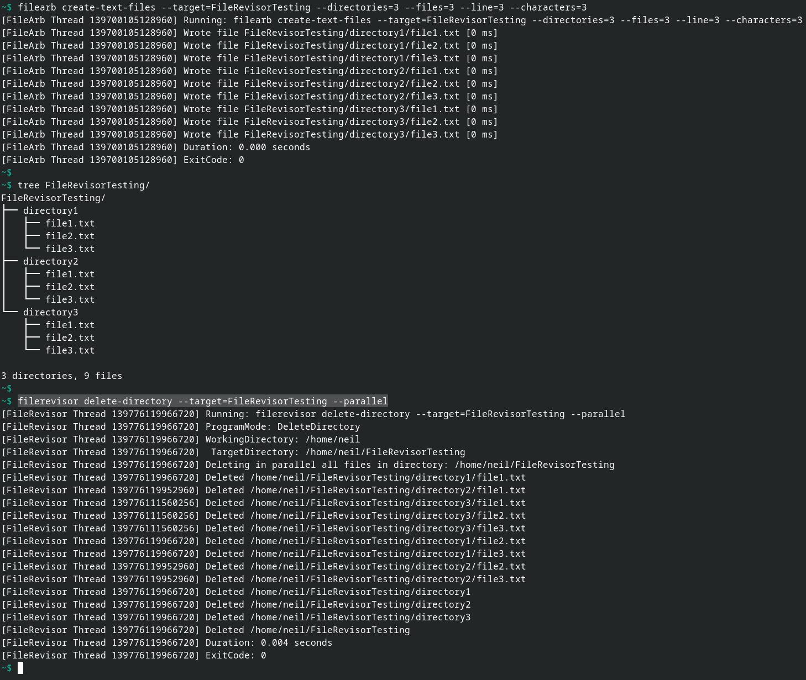
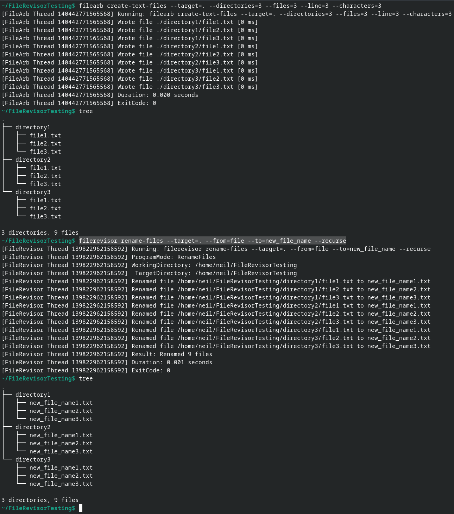
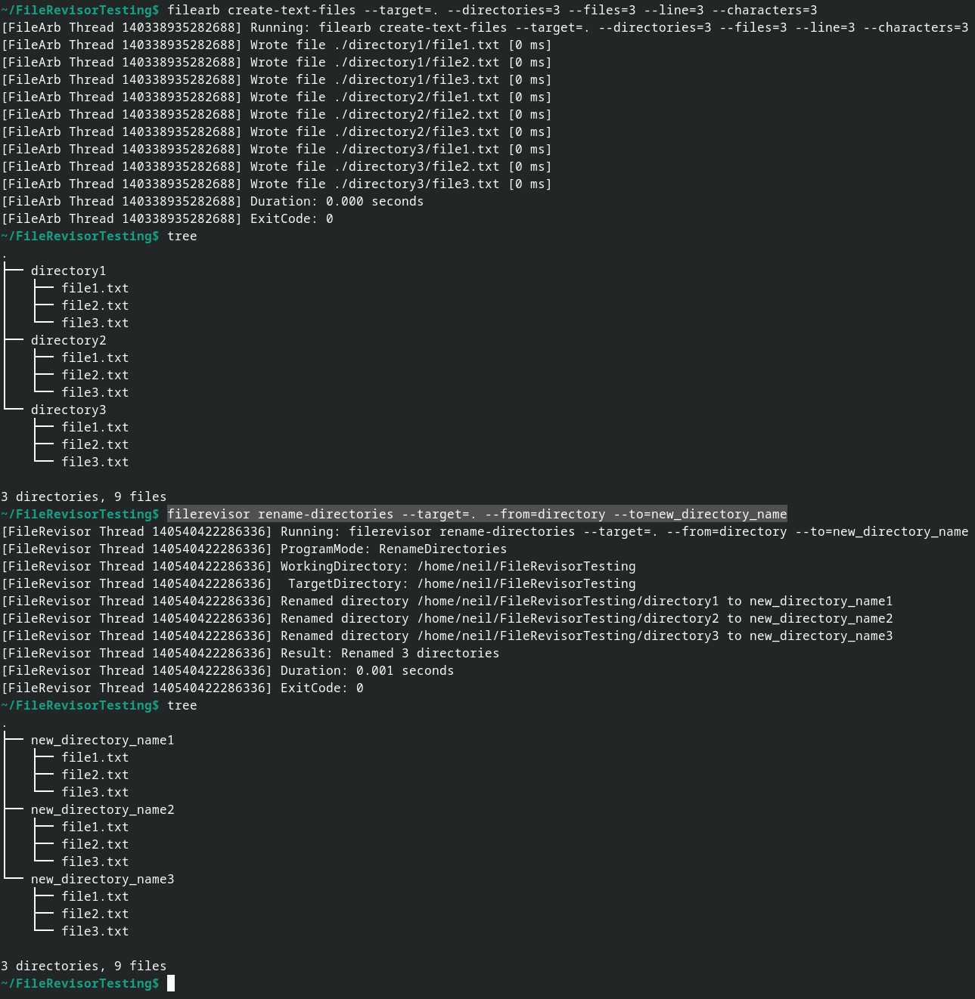
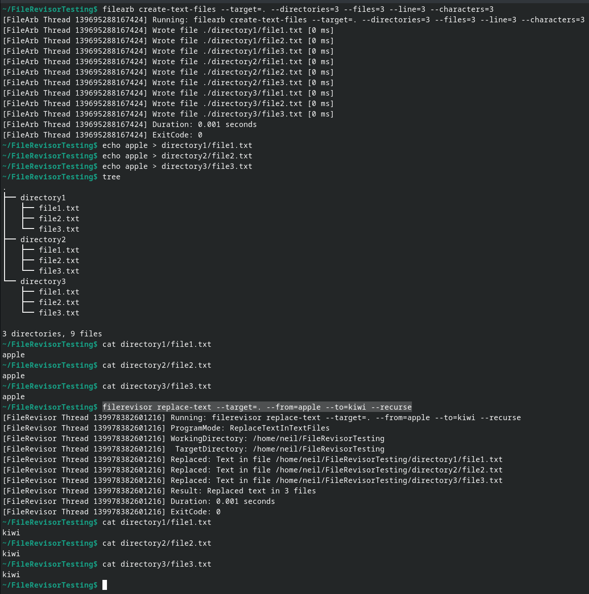
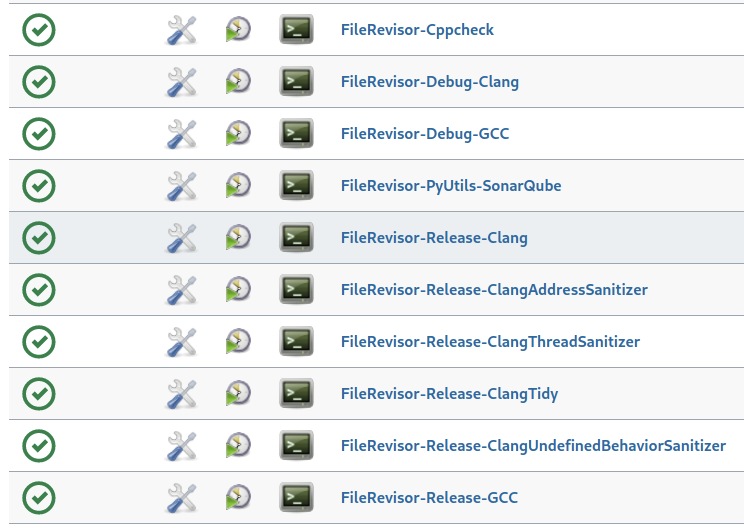
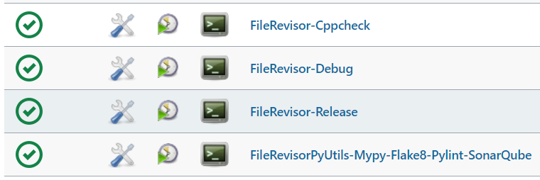

# 🗂️ FileRevisor 🗂️

[](https://en.wikipedia.org/wiki/C%2B%2B20)  

FileRevisor is a cross-platform C++ command line program for quickly deleting large directories in parallel, quickly renaming files or directories, and quickly replacing text in text files.

FileRevisor's key feature is its extreme performance when deleting large folders in parallel on Windows. On Linux, directory deletions are quite a bit faster than on Windows, and so the parallel directory deletion peformance boost which FileRevisor provides is more modest on Linux relative to Windows. See below for Linux vs. Windows directory deletion performance graphs.

|Build Type|Build Status|
|----------|------------|
|GitHub Actions Debug and Release build - ubuntu-latest Clang 11 / GCC 10|[](https://github.com/NeilJustice/FileRevisor/actions/workflows/build.yml)|
|AppVeyor Debug and Release build - Visual Studio 2022 x64|<a href="https://ci.appveyor.com/project/NeilJustice/FileRevisor"></a>|
|Codecov.io code coverage for FileRevisor's C++ and FileRevisorDevOpsPython|[](https://codecov.io/gh/NeilJustice/FileRevisor)|
|SonarCloud scan of FileRevisorDevOpsPython - the Python code which builds and tests FileRevisor|[](https://sonarcloud.io/dashboard?id=NeilJustice_FileRevisor)|

FileRevisor is rigorously unit tested with <a href="https://github.com/NeilJustice/ZenUnitAndMetalMock">ZenUnit and MetalMock</a>.

* [FileRevisor command line usage](#filerevisor-command-line-usage)
* [FileRevisor program modes](#filerevisor-program-modes)
  * [delete-directory](#delete-directory)
  * [rename-files](#rename-files)
  * [rename-directories](#rename-directories)
  * [replace-text](#replace-text)
* [Linux FileRevisor parallel directory deletion performance](#linux-filerevisor-parallel-directory-deletion-performance)
* [Windows FileRevisor parallel folder deletion performance](#windows-filerevisor-parallel-folder-deletion-performance)
* [FileRevisor code structure as it appears in Visual Studio Code on Linux](#filerevisor-code-structure-as-it-appears-in-visual-studio-code-on-linux)
* [FileRevisor code structure as it appears in Visual Studio 2022 on Windows](#filerevisor-code-structure-as-it-appears-in-visual-studio-2022-on-windows)
* [Linux Jenkins jobs which build, cppcheck, clang-tidy, AddressSanitize, UndefinedBehaviorSanitize, and ThreadSanitize FileRevisor's C++ code and mypy-flake8-pylint-SonarQube FileRevisor's CI/CD Python code](#linux-jenkins-jobs-which-build-cppcheck-clang-tidy-addresssanitize-undefinedbehaviorsanitize-and-threadsanitize-filerevisors-c-code-and-mypy-flake8-pylint-sonarqube-scan-filerevisors-cicd-python-code)
* [Windows Jenkins jobs which build and cppcheck FileRevisor's C++ code and mypy-flake8-pylint-SonarQube FileRevisor's CI/CD Python code](#windows-jenkins-jobs-which-build-and-cppcheck-filerevisors-c-code-and-mypy-flake8-pylint-sonarqube-scan-filerevisors-cicd-python-code)
* [4 steps to build binary filerevisor from source on Linux with Clang](#4-steps-to-build-binary-filerevisor-from-source-on-linux-with-clang)
* [4 steps to build executable FileRevisor.exe from source on Windows with Visual Studio 2022](#4-steps-to-build-executable-filerevisorexe-from-source-on-windows-with-visual-studio-2022)

## FileRevisor command line usage

```ini
FileRevisor v1.1.0 - Quickly deletes directories, renames files, renames directories, or replaces text in files.

Usage:
   filerevisor delete-directory
      --target=<TargetDirectoryPath>
      [--parallel]
      [--skip-files-in-use]
      [--dryrun]
      [--quiet]
   filerevisor rename-files
      --target=<TargetDirectoryPath>
      --from=<FileNameRegex>
      --to=<FileNameRegex>
      [--recurse]
      [--dryrun]
      [--verbose]
   filerevisor rename-directories
      --target=<TargetDirectoryPath>
      --from=<DirectoryNameRegex>
      --to=<DirectoryNameRegex>
      [--recurse]
      [--dryrun]
      [--verbose]
   filerevisor replace-text
      --target=<TargetDirectoryPath>
      --from=<FileTextRegexPattern>
      --to=<ReplacementFileTextRegexPattern>
      [--recurse]
      [--dryrun]
      [--verbose]
```

## FileRevisor program modes

### delete-directory

```ini
filerevisor delete-directory
   --target=<TargetDirectoryPath>
   [--parallel]
   [--skip-files-in-use]
   [--dryrun]
   [--quiet]
```

FileRevisor `delete-directory` mode quickly deletes all files in and below `--target=<TargetDirectoryPath>`. For extreme directory deletion performance, especially on Windows, specify `--parallel` to delete subdirectories below `TargetDirectoryPath` using one thread per subdirectory.

Here is `filerevisor delete-directory` in action:



### rename-files

```ini
filerevisor rename-files
   --target=<TargetDirectoryPath>
   --from=<FileNameRegex>
   --to=<FileNameRegex>
   [--recurse]
   [--dryrun]
   [--verbose]
```

FileRevisor `rename-files` mode renames files in a specified directory matching a specified regular expression. `--recurse` can be specified to rename files in and below a specified directory.

Here is `filerevisor rename-files` in action:



### rename-directories

```ini
filerevisor rename-directories
   --target=<TargetDirectoryPath>
   --from=<DirectoryNameRegex>
   --to=<DirectoryNameRegex>
   [--recurse]
   [--dryrun]
   [--verbose]
```

FileRevisor `rename-directories` mode renames directories in a specified directory matching a specified regular expression. `--recurse` can be specified to rename directories in and below a specified directory.

Here is `filerevisor rename-directories` in action:



### replace-text

```ini
filerevisor replace-text
   --target=<TargetDirectoryPath>
   --from=<FileTextRegexPattern>
   --to=<ReplacementFileTextRegexPattern>
   [--recurse]
   [--dryrun]
   [--verbose]
```

FileRevisor `replace-text` mode replaces text in files in a specified directory matching a specified regular expression. `--recurse` can be specified to replace text in files in and below a specified directory.

Here is `filerevisor replace-text` in action:



### Linux FileRevisor parallel directory deletion performance


### Windows FileRevisor parallel folder deletion performance


As you can see from the above two graphs, Linux file deletions are quite a bit faster than Windows file deletions, with modest time savings available on Linux and massive time savings available on Windows by way of FileRevisor --parallel directory deletion.

The OS, CPU, and storage hardware which generated the above performance numbers is Fedora 33 / Windows 10, 32-core 64-thread AMD Threadripper 2990WX, and a 512 GB Samsung 970 PRO NVMe drive.

### FileRevisor code structure as it appears in Visual Studio Code on Linux

Shown in this screenshot is function `FileRevisorArgsParser::ParseArgs` which uses the excellent single-header command line arguments parsing library [docopt.cpp](https://github.com/docopt/docopt.cpp) to parse FileRevisor's command line arguments:


### FileRevisor code structure as it appears in Visual Studio 2022 on Windows

Shown in this screenshot is function `DeleteDirectorySubProgram::Run` with the key if-statement highlighted for determining whether to delete a given directory's subdirectories in parallel or sequentially:


### Linux Jenkins jobs which build, Cppcheck, clang-tidy, AddressSanitize, UndefinedBehaviorSanitize, and ThreadSanitize FileRevisor's C++ code and Mypy-Flake8-Pylint-SonarQube scan FileRevisor's CI/CD Python code



### Windows Jenkins jobs which build and Cppcheck FileRevisor's C++ code and Mypy-Flake8-Pylint-SonarQube scan FileRevisor's CI/CD Python code



## 4 steps to build binary filerevisor from source on Linux with Clang

```bash
git clone https://github.com/NeilJustice/FileRevisor
cd FileRevisor && mkdir Release && cd Release
CXX=clang++ cmake .. -DCMAKE_BUILD_TYPE=Release
sudo cmake --build . --target install
```

Resulting binary `/usr/local/bin/filerevisor`:


## 4 steps to build executable FileRevisor.exe from source on Windows with Visual Studio 2022

```powershell
git clone https://github.com/NeilJustice/FileRevisor
cd FileRevisor
cmake . -G"Visual Studio 17 2022" -A x64 -DCMAKE_INSTALL_PREFIX=C:\bin
cmake --build . --config Release --target install
```

Resulting executable `C:\bin\FileRevisor.exe`:


