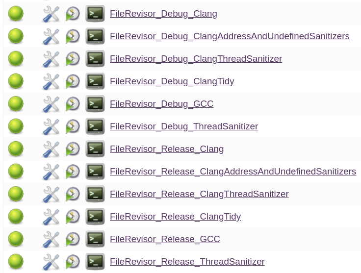

# FileRevisor 🗂️

[](https://en.wikipedia.org/wiki/C%2B%2B20)  

FileRevisor is a C++ command line program for quickly deleting large directories in parallel, bulk renaming files and directories with names that match a regular expression, and bulk replacing text in files that matches a regular expression.

|Build Type|Build Status|
|----------|------------|
|Travis CI Linux Clang 9.0.1 and Linux GCC 9.3.0|[](https://travis-ci.com/NeilJustice/FileRevisor)|
|AppVeyor Windows Visual Studio 2019 x64 Debug and Release|<a href="https://ci.appveyor.com/project/NeilJustice/FileRevisor"></a>|
|Code Coverage For The Travis CI Linux GCC 9.3.0 Release Build|[](https://codecov.io/gh/NeilJustice/FileRevisor)|

FileRevisor is rigorously unit tested with <a href="https://github.com/NeilJustice/ZenUnitAndMetalMock">ZenUnit and MetalMock</a>.

* [FileRevisor Command Line Usage](#filerevisor-command-line-usage)
* [FileRevisor Program Modes](#filerevisor-program-modes)
  * [delete-directory](#delete-directory)
  * [rename-files](#rename-files)
  * [rename-directories](#rename-directories)
  * [replace-text](#replace-text)
* [Windows Folder Deletion Performance: CMD vs. Git Bash vs. PowerShell vs. FileRevisor delete-directory --parallel](#windows-folder-deletion-performance-cmd-vs-git-bash-vs-powershell-vs-filerevisor-delete-directory---parallel)
* [Linux Folder Deletion Performance: rm -rf > /dev/null vs. FileRevisor](#linux-folder-deletion-performance-rm-rf->-dev-null-vs-FileRevisor)
* [Linux Jenkins Jobs Which Compile, clang-tidy, AddressSanitize, UndefinedBehaviorSanitize, and ThreadSanitize FileRevisor](#linux-jenkins-jobs-which-compile-clang-tidy-addresssanitize-undefinedbehaviorsanitize-and-threadsanitize-filerevisor)
* [Windows Jenkins Jobs Which Compile FileRevisor](#windows-jenkins-jobs-which-compile-filerevisor)
* [How To Build FileRevisor From Source On Linux](#how-to-build-filerevisor-from-source-on-linux)
* [How To Build FileRevisor From Source on Windows](#how-to-build-filerevisor-from-source-on-windows)

## FileRevisor Command Line Usage

```
FileRevisor v0.9.6
https://github.com/NeilJustice/FileRevisor

Usage:
   filerevisor delete-directory
      --target=<TargetDirectoryPath>
      [--parallel]
      [--minimal]

   filerevisor rename-files
      --target=<TargetDirectoryPath>
      --from=<FileNameRegex>
      --to=<FileNameRegex>
      [--recurse]
      [--preview]
      [--verbose]

   filerevisor rename-directories
      --target=<TargetDirectoryPath>
      --from=<DirectoryNameRegex>
      --to=<DirectoryNameRegex>
      [--recurse]
      [--preview]
      [--verbose]

   filerevisor replace-text
      --target=<TargetDirectoryPath>
      --from=<FileTextRegexPattern>
      --to=<ReplacementFileTextRegexPattern>
      [--recurse]
      [--preview]
      [--verbose]
```

FileRevisor command line arguments are parsed using the excellent single-header library [docopt.cpp](https://github.com/docopt/docopt.cpp):


## FileRevisor Program Modes

### delete-directory

FileRevisor `delete-directory` quickly deletes a directory, optionally in parallel for extreme directory deletion performance, especially on Windows.

Shown in this screenshot is `filerevisor delete-directory` deleting `directory1` in parallel:


### rename-files

FileRevisor `rename-files` renames files in a specified directory matching a specified regular expression. `--recurse` can be specified to rename files in and below a specified directory.

Shown in this screenshot is `filerevisor rename-files` renaming files with name `file` to new name `new_file_name` in the current directory:


### rename-directories

FileRevisor `rename-directories` renames directories in a specified directory matching a specified regular expression. `--recurse` can be specified to rename directories in and below a specified directory.

Shown in this screenshot is `filerevisor rename-directories` renaming directories with name `directory` to new name `new_directory_name` in the current directory:


### replace-text

FileRevisor `replace-text` replaces text in files in a specified directory matching a specified regular expression. `--recurse` can be specified to replace text in files in and below a specified directory.

Shown in this screenshot is `filerevisor replace-text` replacing text in files in the current directory containing text `apple` with replacement text `orange`:


### Windows Folder Deletion Performance: CMD vs. Git Bash vs. PowerShell vs. FileRevisor delete-directory --parallel


### Linux Folder Deletion Performance: rm -rf > /dev/null vs. FileRevisor


The CPU and storage hardware which generated the above performance numbers is a 32-core 64-thread AMD Threadripper 2990WX with a 512 GB Samsung 970 PRO NVMe drive.

As you can see from the above graphs, the implementation of Linux file deletions is quite a bit faster than the implementation of Windows file deletions, with the time savings from FileRevisor's parallel directory deletion mode being most potent when deleting large directories on Windows.

### Linux Jenkins Jobs Which Compile, clang-tidy, AddressSanitize, UndefinedBehaviorSanitize, and ThreadSanitize FileRevisor

A Jenkins Blue Ocean build pipeline builds the following FileRevisor Jenkins jobs on Fedora 33:



### Windows Jenkins Jobs Which Compile FileRevisor

A Jenkins Blue Ocean build pipeline builds the following FileRevisor Jenkins jobs on Windows 10:


## How To Build FileRevisor From Source On Linux

```bash
git clone https://github.com/NeilJustice/FileRevisor
cd FileRevisor && mkdir Release && cd Release
CXX=clang++ cmake .. -DCMAKE_BUILD_TYPE=Release
sudo cmake --build . --target install
```

Result binary `/usr/local/bin/filerevisor`:


## How To Build FileRevisor From Source On Windows

```powershell
git clone https://github.com/NeilJustice/FileRevisor
cd FileRevisor
cmake . -G"Visual Studio 16 2019" -A x64 -DCMAKE_INSTALL_PREFIX=C:\bin
cmake --build . --config Release --target install
```

Resulting executable `C:\bin\FileRevisor.exe`:


