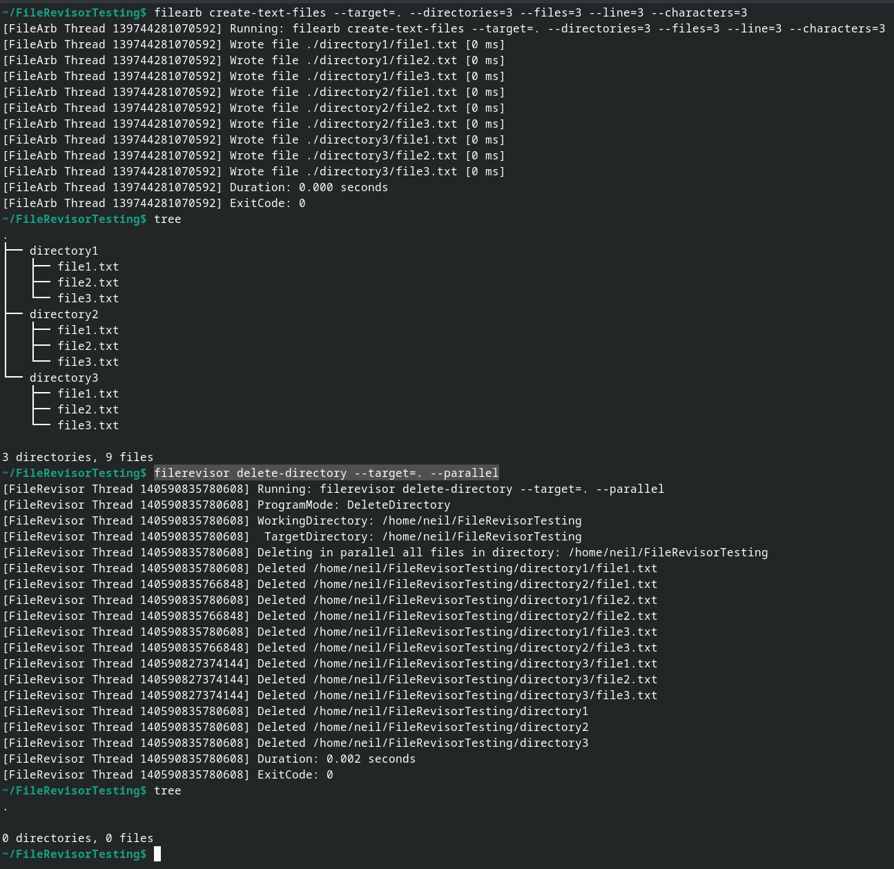
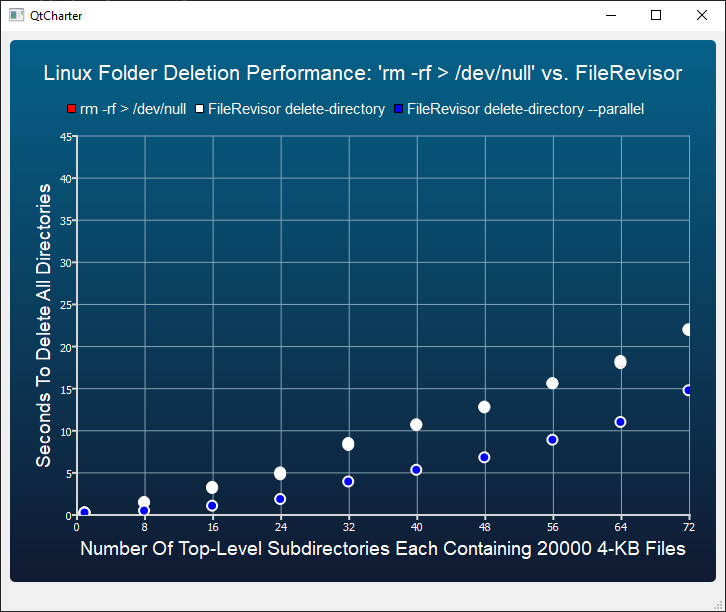
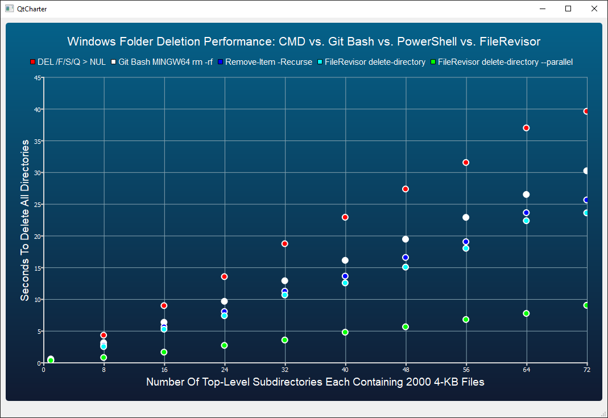

<p align="center">
<br>
</p>

|Build Type|Build Status|
|----------|------------|
|Clang 18 and GCC 13 on ubuntu-latest|<a href="https://github.com/NeilJustice/FileRevisor/actions/workflows/linux_build.yml"></a>|
|VS2026 on windows-latest|<a href="https://github.com/NeilJustice/FileRevisor/actions/workflows/windows_build.yml"></a>|
|GCC lcov code coverage|<a href="https://codecov.io/gh/NeilJustice/FileRevisor"></a>|

FileRevisor is a C++23 command line program for quickly deleting large directories in parallel, renaming files and directories, and replacing text in text files.

* [FileRevisor command line usage](#filerevisor-command-line-usage)
* [FileRevisor program modes](#filerevisor-program-modes)
  * [delete-directory](#delete-directory)
  * [rename-files](#rename-files)
  * [rename-directories](#rename-directories)
  * [replace-text](#replace-text)
* [Linux FileRevisor parallel directory deletion performance](#linux-filerevisor-parallel-directory-deletion-performance)
* [Windows FileRevisor parallel folder deletion performance](#windows-filerevisor-parallel-folder-deletion-performance)
* [Steps to build binary filerevisor from source on Linux with Clang](#steps-to-build-binary-filerevisor-from-source-on-linux-with-clang)
* [Steps to build executable FileRevisor.exe from source on Windows with Visual Studio 2026](#steps-to-build-executable-filerevisorexe-from-source-on-windows-with-visual-studio-2026)
* [Acknowledgements](#acknowledgements)

## FileRevisor command line usage

```ini
FileRevisor v1.1.0

Usage:
   filerevisor delete-directory
      --target=<TargetDirectoryPath>
      [--parallel]
      [--skip-files-in-use]
      [--dryrun]
      [--quiet]
   filerevisor rename-files
      --target=<TargetDirectoryPath>
      --from=<FileNameRegex>
      --to=<FileNameRegex>
      [--recurse]
      [--dryrun]
      [--verbose]
   filerevisor rename-directories
      --target=<TargetDirectoryPath>
      --from=<DirectoryNameRegex>
      --to=<DirectoryNameRegex>
      [--recurse]
      [--dryrun]
      [--verbose]
   filerevisor replace-text
      --target=<TargetDirectoryPath>
      --from=<LiteralFileText>
      --to=<ReplacementLiteralFileText>
      [--recurse]
      [--dryrun]
      [--verbose]
```

## FileRevisor program modes

### delete-directory

```ini
filerevisor delete-directory
   --target=<TargetDirectoryPath>
   [--parallel]
   [--skip-files-in-use]
   [--dryrun]
   [--quiet]
```

FileRevisor `delete-directory` mode quickly deletes all files in and below `--target=<TargetDirectoryPath>`. For extreme directory deletion performance, especially on Windows, specify `--parallel` to delete subdirectories below `TargetDirectoryPath` using one thread per subdirectory.

Here is `filerevisor delete-directory` in action:



### rename-files

```ini
filerevisor rename-files
   --target=<TargetDirectoryPath>
   --from=<FileNameRegex>
   --to=<FileNameRegex>
   [--recurse]
   [--dryrun]
   [--verbose]
```

FileRevisor `rename-files` mode renames files in a specified directory matching a specified regular expression. `--recurse` can be specified to rename files in and below a specified directory.

Here is `filerevisor rename-files` in action:


### rename-directories

```ini
filerevisor rename-directories
   --target=<TargetDirectoryPath>
   --from=<DirectoryNameRegex>
   --to=<DirectoryNameRegex>
   [--recurse]
   [--dryrun]
   [--verbose]
```

FileRevisor `rename-directories` mode renames directories in a specified directory matching a specified regular expression. `--recurse` can be specified to rename directories in and below a specified directory.

Here is `filerevisor rename-directories` in action:


### replace-text

```ini
filerevisor replace-text
   --target=<TargetDirectoryPath>
   --from=<LiteralFileText>
   --to=<ReplacementLiteralFileText>
   [--recurse]
   [--dryrun]
   [--verbose]
```

FileRevisor `replace-text` mode replaces text in files containing a substring with a replacement substring. `--recurse` can be added to replace text in files in and below a specified directory.

Here is `filerevisor replace-text` in action:


### Linux FileRevisor parallel directory deletion performance



### Windows FileRevisor parallel folder deletion performance



As you can see from the above two graphs, Linux file deletions are quite a bit faster than Windows file deletions, with modest time savings available on Linux and massive time savings available on Windows by way of FileRevisor --parallel directory deletion.

The OS, CPU, and storage hardware which generated the above performance numbers is Fedora 33 / Windows 10, 32-core 64-thread AMD Threadripper 2990WX, and a 512 GB Samsung 970 PRO NVMe drive.

## Steps to build binary filerevisor from source on Linux with Clang

```bash
git clone https://github.com/NeilJustice/FileRevisor
cd FileRevisor && mkdir Release && cd Release
CXX=clang++ cmake .. -DCMAKE_BUILD_TYPE=Release
sudo cmake --build . --target install
```

## Steps to build executable FileRevisor.exe from source on Windows with Visual Studio 2026

```powershell
git clone https://github.com/NeilJustice/FileRevisor
cd FileRevisor
cmake . -G"Visual Studio 18 2026" -A x64 -DCMAKE_INSTALL_PREFIX=C:\bin
cmake --build . --config Release --target install
```

## Acknowledgements

<a href="https://brandmark.io">brandmark.io</a> for FileRevisor's logo
